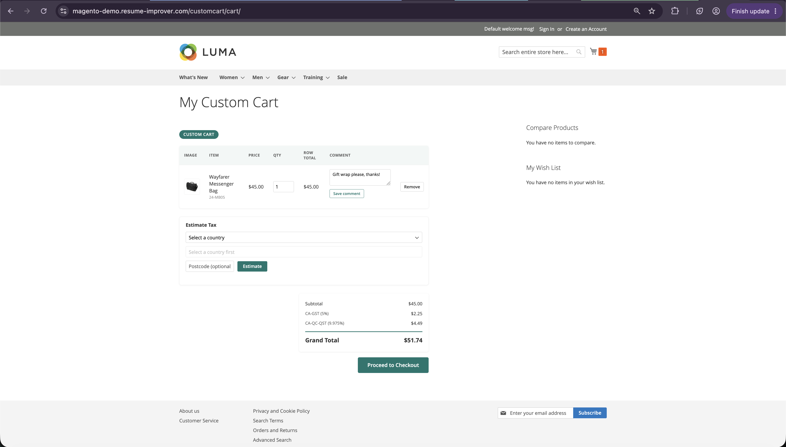
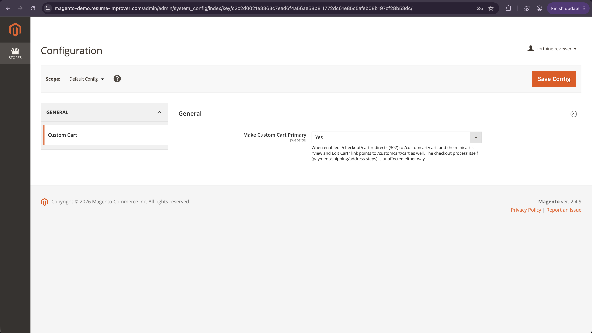

# Ivanchenko_CustomCart

Source: https://github.com/LarikCode/module-custom-cart

A Magento 2 shopping cart module built for a take-home assignment (Senior Magento Developer role at FortNine).

## Live demo

**https://magento-demo.resume-improver.com/**

- **Primary cart**: [`/customcart/cart/`](https://magento-demo.resume-improver.com/customcart/cart/) — a custom-controller cart page, the site's default cart experience
- [`/checkout/cart/`](https://magento-demo.resume-improver.com/checkout/cart/) also works — Magento's own native cart page. By default it 302-redirects to the primary cart above; the admin toggle below switches it back to Magento's stock behavior.

## Install

This repo isn't published on Packagist, so point Composer at the GitHub repo directly as a VCS repository, then require it:

```bash
composer config repositories.custom-cart vcs https://github.com/LarikCode/module-custom-cart
composer require ivanchenko/module-custom-cart:dev-main
bin/magento module:enable Ivanchenko_CustomCart
bin/magento setup:upgrade
bin/magento cache:clean
```

`setup:upgrade` provisions the GST/QST tax rates/rules and the cart-comments DB table — no manual tax configuration or schema step needed.

## Enable/disable the custom cart

**Stores > Configuration > General > Custom Cart > "Make Custom Cart Primary"** (Yes/No, **enabled by default**). Flipping it off makes `/checkout/cart` behave exactly like stock Magento again (no redirect, minicart links back to it); flipping it on restores the primary-cart behavior — no deploy required either way.

## Deployment infrastructure

Deployed on a real Google Cloud Platform VM, not a local-only demo or a one-click PaaS:

- **VM**: `e2-medium` (2 vCPU / 4GB RAM), Google Compute Engine, zone `us-central1-a`
- **OS**: Ubuntu 24.04 LTS
- **Stack**: Magento 2.4.9 on PHP 8.5, running under Docker (nginx, Varnish, PHP-FPM, MySQL, Redis, OpenSearch)
- **Fronted by Cloudflare** (proxied SSL) at the custom domain

## What it demonstrates

- GST/QST tax calculation via Magento's **native tax engine** (a reproducible data patch, not hand-rolled totals code)
- A **custom-controller cart page** built on Magento's own `Quote`/`CheckoutSession`, now the site's primary cart, coexisting with and redirecting from the legacy `/checkout/cart` (admin-configurable)
- **Per-item cart comments** backed by a new DB table, using parameterized queries and escape-on-output rendering
- **Cart quantity validation** (100-unit cap) via a core plugin
- An **AJAX tax-estimate form** backed by real country/region data
- An **admin-configurable toggle** driving both the redirect and minicart-link behavior from one config value
- **Full PHPUnit test coverage** (77 tests)

## Screenshots

**Custom cart page** — product image, quantity input, a saved comment, and the GST/QST tax breakdown after a Quebec address estimate:



**Admin config toggle** — Stores > Configuration > Custom Cart > General:



---

## Architecture notes and design decisions (for a deeper read)

The rest of this document goes deeper into the "why" behind specific implementation choices — useful for a thorough review, not required to understand what the module does.

### Cart quantity guard

A `beforeUpdate` plugin on `Magento\Quote\Model\Quote\Item\Updater::update` rejects cart quantities over 100 units with a clear, actionable error message, without altering core update behavior for valid quantities.

### GST/QST tax breakdown, via Magento's native tax engine

A data patch (`Setup/Patch/Data/InstallCanadianTaxRates.php`) provisions Canadian GST (5%, all provinces) and Quebec QST (9.975%, Quebec only) as native Magento Tax Rates and Tax Rules on `setup:upgrade`, instead of a hand-run admin wizard or a custom totals collector. This module originally implemented GST/QST as two custom `Magento\Quote\Model\Quote\Address\Total\AbstractTotal` collectors; that approach was removed in favor of configuring Magento's own tax engine, because:

- Magento's tax engine is *already* the correct, audited way to model jurisdiction-based tax rates and rules — admin-editable without a deploy, integrated with tax reports, and exercised by every other part of checkout (shipping estimate, order totals, invoices, credit memos) that a hand-rolled totals collector would otherwise have to duplicate.
- It closes a real, previously-unresolved gap for free: the old custom collectors' Knockout registration for the storefront cart sidebar never rendered there for a reason that was investigated at length and never diagnosed. Native tax rules render through Magento's own already-working `Magento_Tax` Knockout component, so the GST/QST breakdown now genuinely appears as separate rows in the storefront cart sidebar — not just in server-rendered contexts.
- A third-party module hand-computing tax is also just the wrong layer: a real Canadian Magento store configures GST/QST as Tax Zones/Rates/Rules, not custom totals code.

**The one detail that was easy to get wrong, and initially was wrong:** GST and QST must live in **two separate Tax Rules** (each with its own single rate), not one rule containing both rates. Both rules share the same `priority` (`0`) and both have `calculate_subtotal = true`. The first version of this patch put both rates in a single rule, which looked correct in code review and passed unit tests (which only assert on the calls made *to* the tax API, not on Magento's own tax-calculation internals) — but silently dropped GST from the total. Root cause: a genuine bug in Magento core's `Magento\Tax\Model\ResourceModel\Calculation::_calculateRate()`, whose inner `while` loop skips ahead through every rate sharing one `tax_calculation_rule_id`, advancing the array pointer *without* accumulating each individual rate's value — so only the first rate seen in sort order survives when two rates share a rule. Splitting GST and QST into their own rules avoids the buggy loop entirely (it only triggers *within* a single `rule_id`); keeping both rules at the same priority with `calculate_subtotal = true` is what routes them into the additive branch (`$result += $currentRate`, both computed against the pre-tax subtotal) instead of the compounding branch (`_collectPercent()`, which would tax QST on a GST-inclusive amount — the wrong, pre-2013 rule). This was caught only by testing against the real tax-calculation engine (see "Verifying the tax math" below).

`tax/cart_display/full_summary` is also set to `1` by the patch — this is the config flag that gates whether the per-rate breakdown renders as separate "CA-GST (5%)" / "CA-QC-QST (9.975%)" sub-rows under "Tax" in the cart summary, rather than collapsing to a single combined "Tax" figure.

### Loyalty points estimate

An informational-only "Estimated Loyalty Points Earned" row, showing 1 point per $10 spent (floor-rounded), hidden entirely below the 1-point threshold. This repurposes the totals-collector architecture slot the old GST/QST collectors used to occupy, onto something that genuinely has no native Magento Open Source equivalent: Reward Points is an Adobe Commerce-only feature, absent entirely from Open Source. A cart discount would have overlapped Cart Price Rules; a loyalty-points *estimate* does not overlap anything Magento OSS already does. It's deliberately informational-only and appears in two independent places, sharing one formula (`Model/LoyaltyPointsCalculator.php`) so they can't drift apart:

- **Cart/checkout context**: `Model/Total/Quote/LoyaltyPoints.php`, a quote totals collector registered via `etc/sales.xml`. `fetch()` never calls `addTotalAmount()`, so it structurally cannot affect the grand total.
- **Order view and order confirmation email**: `Block/Sales/Order/Totals.php`, hooked into `Magento\Sales\Block\Order\Totals` the same way `Magento_Weee` adds its own row (an `initTotals()` method the parent block calls on every child that declares it), registered via `sales_order_view.xml`, `sales_guest_view.xml`, and `sales_email_order_items.xml`. This recomputes from the order's persisted subtotal rather than reading the quote-side collector's output, since order totals aren't sourced from quote collectors at render time.

### Custom cart page: the site's primary cart

The module demonstrates two complementary Magento extension patterns: extending the existing cart (above — plugins, a data patch, totals collectors layered onto `/checkout/cart`), and a **custom-controller cart page** (`/customcart/cart`) that reuses `Quote`/`CheckoutSession` as its data layer, with its own service classes, AJAX endpoints, and templates. Both pages read and write the *same* quote — add an item on one, it shows up on the other.

`/customcart/cart` is, by default, the site's real primary cart page: `/checkout/cart` redirects to it and the header minicart links to it, both controlled by one admin toggle (see below). `/checkout/cart` itself is untouched — nothing was deleted or disabled, it's just no longer the page a shopper lands on by default. The actual checkout flow (payment/shipping/address steps at `/checkout/`) is completely unaffected either way; only the cart *page* changes.

**Product images**: `CartService::buildItemData()` resolves each line item's thumbnail via `Magento\Catalog\Block\Product\ImageFactory::create($product, 'cart_page_product_thumbnail')->getImageUrl()` — the same non-deprecated factory-based API `Checkout\Block\Cart\Item\Renderer` uses for `/checkout/cart`, not the older `ImageBuilder` class. Falls back to `null` when a line item has no linked product.

**Styling**: everything is scoped under a single `.customcart-page` selector in the existing `view/frontend/web/css/source/_module.less` — no new stylesheet, nothing leaks into Luma's own cart page. One accent color (teal, deliberately distinct from Luma's blue primary button and this module's own existing red/green semantic colors) is used consistently for the badge, focus states, the grand-total border, and the checkout button.

**"Proceed to Checkout" button**: links to the real `checkout/` route — checkout itself was not rebuilt or touched. `aria-disabled`/`tabindex="-1"` (not `disabled`, which doesn't apply to `<a>` tags) whenever the cart is empty, both on initial render and after the last item is removed via AJAX.

#### The redirect plugin

`Plugin/Checkout/Cart/IndexRedirectPlugin.php` is an `aroundExecute` plugin on `Magento\Checkout\Controller\Cart\Index::execute()`. When the admin toggle is on, it returns a `Redirect` to `customcart/cart/index` instead of calling `$proceed()`; when off, it calls `$proceed()` and returns Magento's normal cart page unchanged.

Two things worth being explicit about, both verified by reading the relevant core source directly rather than assumed:
- **It's a 302, not a 301.** `Redirect::render()` falls back to the inherited `Response::setRedirect($url, $code = 302)` default when no explicit HTTP code is set, and this plugin never calls `setHttpResponseCode()`. A 301 would tell browsers/CDNs to cache the redirect permanently, which is the wrong call for something a store admin can flip back off at any time.
- **It can't break other cart AJAX endpoints.** `Cart\Index::execute()` has no internal `_forward()`/redirect logic of its own, and no other core `Checkout\Controller\Cart\*` class (`Add`, `UpdateItemQty`, `CouponPost`, `EstimatePost`, etc. — all separately routed) depends on `Cart\Index::execute()` having rendered. The plugin is scoped to that one class, so Luma's minicart qty updates, coupon application, etc. keep working exactly as before regardless of the toggle.

#### The minicart link

`Plugin/Checkout/Cart/SidebarConfigPlugin.php` is an `afterGetConfig` plugin on `Magento\Checkout\Block\Cart\Sidebar`. Reading that block's source directly showed `getConfig()` returns a plain array (including `shoppingCartUrl`) computed fresh on every call, with no instance-level caching — and that array becomes `window.checkout.shoppingCartUrl`, which the minicart's Knockout template binds the "View and Edit Cart" link's `href` to. That meant the minimal, correct fix was to swap one array key when the toggle is on:

```php
$result['shoppingCartUrl'] = $this->urlBuilder->getUrl('customcart/cart');
```

No template or JS override was needed — deliberately the least invasive of the options considered. A full template/Knockout override was ruled out specifically because it would mean owning a large shared component used by every other part of the site's cart UI, for a one-line URL change.

**Caching caveat, not a bug:** the minicart's HTML is cached client-side via Magento's customer-data "sections" mechanism (`mage-cache-storage` in `localStorage`). Flipping the admin toggle won't retroactively update an *already-open* browser tab's minicart — a normal page reload picks up the new link.

#### Tax-estimate form

The custom cart page has its own "Estimate Tax" form (country, region, optional postcode) that recalculates totals via AJAX, without navigating away or reloading — separate from `/checkout/cart`'s own "Estimate Shipping and Tax" widget, though both ultimately mutate the same quote's shipping address.

- **Real country list, not hardcoded to Canada.** `Model/RegionDataProvider.php` sources countries from `Magento\Directory\Model\ResourceModel\Country\CollectionFactory` (respecting `general/country/allow`) — even though only Canada has tax rules configured in this module, the form doesn't assume that.
- **Region-to-country cascading happens client-side**, from a single baked `{country_id: {region_id: {code, name}}}` JSON payload delivered via an escaped `data-regions` HTML attribute (not a `<script type="application/json">` block, which sidesteps `</script>`-in-content escaping edge cases entirely).
- **Postcode is accepted but not required for correct results.** Reading `Magento\Tax\Model\ResourceModel\Calculation`'s actual rate-matching SQL directly showed the real predicate is `tax_country_id = ?` AND `tax_region_id IN (?, [0, $regionId])` AND (separately) `tax_postcode IS NULL OR tax_postcode IN ('*', '', ?)`. This module's GST rate is scoped to all of Canada (`region_id = 0`) and QST to Quebec specifically, both with postcode `*` — so **region, not postcode, is the real discriminator** for whether GST/QST match.
- **The mutate-then-recollect sequence matters.** `CartService::estimateTax()` sets country/region/postcode on `$quote->getShippingAddress()`, then calls `$quote->collectTotals()`, then saves via `$quoteRepository`, mirroring the exact sequence read directly from `Magento\Checkout\Model\Cart::save()`. Skipping or reordering this would risk saving a quote with a stale/uncollected total.
- **Before any address is entered**, and for a genuinely $0-tax country, the totals show "Tax calculated at checkout" rather than a blank or misleading "$0.00" row.
- Country/region validation rejects unknown country codes and any region that doesn't belong to the selected country before ever touching the quote — covered by `Test/Unit/Model/CartServiceTest.php`.

#### The admin toggle

Stores > Configuration > General > Custom Cart > "Make Custom Cart Primary" (`Yes`/`No`, enabled by default), website-scoped (a routing/deployment decision, not per-store-view merchandising). One shared `Model/Config.php` wraps `ScopeConfigInterface` behind a single `isCustomCartPrimary(): bool` method and a single config path constant, used by both the redirect plugin and the minicart plugin — so there's exactly one place in the codebase that knows the config path string, and flipping the toggle changes both behaviors consistently. `etc/config.xml` sets the default to `1` (on).

An `etc/acl.xml` resource (`Ivanchenko_CustomCart::config`, chained under `Magento_Config::config`) was added alongside the `system.xml` section — without it, the new admin section would be invisible even to a fully-permissioned admin role.

### Decision: new section in this module, not a separate module

Both features depend on `Magento_Quote`/`Magento_Checkout`, already sequenced in this module's `module.xml`. A second module would need to either duplicate that sequence or declare a dependency back on this one — more ceremony than benefit for a single-repo take-home submission demonstrating two patterns, not two products.

### Decision: direct `ResourceConnection`, not Model/ResourceModel/Collection

Cart item comments (`ivanchenko_customcart_item_comment`, via `etc/db_schema.xml`) are a genuinely new feature with no Magento core equivalent, so they're the deliberate place to show safe *direct* database access. `CartItemCommentRepository` wraps `ResourceConnection`/`AdapterInterface` directly rather than using the AbstractModel/ResourceModel/Collection stack. This is not "raw SQL" in the unsafe sense — every value reaches the database through a bound parameter:

```php
// What this code does (parameterized):
$connection->insertOnDuplicate($table, ['quote_item_id' => $id, 'comment_text' => $text], ['comment_text']);
$connection->select()->from($table)->where('quote_item_id = ?', $id);

// What it deliberately avoids (string concatenation):
"INSERT INTO {$table} VALUES ('{$text}')"
"WHERE quote_item_id = " . $id
```

`insertOnDuplicate()` builds an internal bind array (confirmed by reading `vendor/magento/framework/DB/Adapter/Pdo/Mysql.php`); the `?` in `where()` is Zend_Db's parameterized placeholder, substituted via `quoteInto()` internally — neither path ever formats a value into a SQL string.

### Injection prevention

Two distinct risks, two distinct mitigations, both exercised by this module's tests:

- **SQL injection** — prevented by never concatenating comment text into SQL (see above). A payload like `'; DROP TABLE ivanchenko_customcart_item_comment; --` is bound as an opaque string value; there is no code path where it's ever interpreted as SQL syntax. Verified in `Test/Unit/Model/CartItemCommentRepositoryTest.php` and empirically against a live install.
- **Stored XSS** — prevented by *escaping on render*, not stripping on input. Comment text is stored verbatim (after trimming and a server-side length check); a payload like `<script>alert(1)</script>` is saved exactly as typed. The defense is at render time: `$block->escapeHtml()` on the template's initial server render, and `.textContent`/`.value` DOM assignment (never `.innerHTML`) in `web/js/customcart.js` after an AJAX save. Stripping/blocklisting tags on input was deliberately not used: it's bypassable and lossy; output-encoding is the standard, robust defense.

Ownership is also checked before any read/write: `CommentService`/`CartService` both verify `$checkoutSession->getQuote()->getItemById($itemId) !== false` before touching a comment or a quantity — the same generic "item not found" error either way, so a request can't distinguish "this ID doesn't exist" from "this ID belongs to someone else's quote."

### A real API trap, caught by testing rather than assuming

`Quote::getTotals()` returns `'subtotal'`/`'tax'`/`'grand_total'` correctly at the quote-aggregate level. The obvious-looking read for the per-rate GST/QST breakdown — `$quote->getTotals()['tax']->getData('full_info')` — comes back **empty**, even though the tax *amount* is correct. Tracing why: `Magento\Quote\Model\Quote\TotalsCollector::collect()` only copies `shippingAmount`/`subtotal`/`subtotalWithDiscount`/`grandTotal` up from each address's computed total onto the quote-level aggregate — applied-tax detail is never among the fields it copies up. The real per-rate detail lives one level down: `$quote->getShippingAddress()->getAppliedTaxes()` (backed by the `quote_address.applied_taxes` column). `CartService::buildTaxBreakdown()` uses that instead, confirmed against a live Quebec-address quote before relying on it.

That data still only carries a combined dollar amount per rate group (GST+QST share one group here, by the same non-compounding design as the tax patch), not a per-rate figure — each rate's own dollar amount is derived the same way Magento's own storefront Tax Knockout component computes it client-side: `percent x pre-tax subtotal`.

### CSRF for the AJAX endpoints

The four POST controllers (`Update`, `Remove`, `Comment`, `EstimateTax`) do **not** implement `CsrfAwareActionInterface`. Magento's default `CsrfValidator` already passes a POST through without a form key if the request is XHR-detected (`X-Requested-With: XMLHttpRequest`, checked via `Http::isXmlHttpRequest()`) — `web/js/customcart.js` always sends that header on every `fetch()` call, the same mechanism core's own AJAX cart controllers rely on.

## Known limitations

`LoyaltyPoints` does not render on the storefront **cart page**. Its first implementation targeted `checkout.cart.totals` — the legacy server-rendered totals block — but Luma's cart page shows totals exclusively through a Knockout-driven "Summary" sidebar, so that registration never rendered anything and was replaced with the order-view/email registration described above. (This module's *earlier* GST/QST Knockout registration for that same sidebar had the opposite problem — structurally correct but never rendered there, for a reason investigated and never diagnosed — which is one more reason GST/QST moved to the native tax engine instead.) A Knockout registration for loyalty points on the cart page was not attempted a second time, given it's a lower-stakes, informational-only feature.

PDF invoices are also not covered: Magento renders PDF totals through a different, non-layout-XML mechanism from the `order_totals` block hook used here. The order confirmation email registration uses the identical mechanism already confirmed working on the order-view page, but sending a confirmation email in the Docker dev environment requires the async email queue consumer to run, which wasn't exercised end-to-end — so email rendering is inferred from the shared mechanism, not independently screenshotted.

Cart item comments persist correctly and survive order placement, but aren't currently surfaced anywhere after checkout — not on the admin Order View, not on the storefront order view. This is a fulfillment-visibility gap, not a data-loss bug: a "please gift wrap" note is saved but never seen by whoever fulfills the order. Separately, the comment row's `ON DELETE CASCADE` FK to `quote_item` means a comment could be silently lost whenever Magento's routine quote-cleanup cron eventually purges the originating quote item, even though the order itself persists indefinitely — worth accounting for if this feature is ever extended into real production use.

## Module scope, deliberately

The tax/plugin/totals-collector side of this module does **not** touch core Quote/QuoteItem database tables or rebuild any part of checkout — one `beforeUpdate` plugin, one data patch configuring Magento's own tax engine, one informational totals collector plus its order-view/email counterpart, and layout overrides pointing at containers Magento already renders. The custom cart page is the module's first genuinely new surface area: its own controllers, a new route, and one new database table (cart item comments) — but it's still scoped narrowly: no core tables are modified, the new table only stores comment text keyed to an existing `quote_item.item_id` (with a cascading FK), and no core files are overridden anywhere in this module — every behavior change, including the redirect and minicart-link plugins, is a plugin or layout addition, never a core class rewrite. `/checkout/cart`'s own controller and the actual checkout flow are not modified in any way; the redirect plugin only intercepts where the GET request lands, is entirely config-gated and reversible, and every other `Checkout\Controller\Cart\*` endpoint keeps working unchanged regardless of the toggle.

## Running the tests

From within a full Magento 2 instance with this module installed:

```bash
vendor/bin/phpunit vendor/ivanchenko/module-custom-cart/Test/Unit
```

Or standalone, from this repo (requires a `repo.magento.com` `auth.json` for the `magento/*` dev dependencies):

```bash
composer install
vendor/bin/phpunit
```

77 tests cover: the tax data patch's call contract (including the two-separate-rules regression guard), the loyalty points formula and its two render locations, the quantity guard plugin, the custom cart page's business logic (GST/QST breakdown, quantity/comment validation, ownership checks, `estimateTax()`'s address-mutation sequence and validation), the comment repository's parameterized-call shape and the two injection-safety cases (SQLi payload, XSS payload), the redirect and minicart-link plugins' config-gated behavior, and the region/country data provider.

### Verifying the tax math

Because unit tests can't exercise Magento's own tax-calculation engine, the non-compounding GST/QST behavior was verified against a running instance via the cart totals REST endpoint: create a guest cart, add an item, set the shipping address via `POST /rest/V1/guest-carts/{id}/shipping-information`, then `GET /rest/V1/guest-carts/{id}/totals` and check `total_segments[].extension_attributes.tax_grandtotal_details`. Confirmed: a Quebec address applies both GST and QST, each computed on the pre-tax subtotal (e.g. $45 subtotal -> GST $2.25 + QST $4.49, not QST calculated on $47.25); an Ontario address applies GST only; a US address applies neither. The same breakdown is visible on both `/checkout/cart` (expand the "Tax" row, enabled by `tax/cart_display/full_summary`) and `/customcart/cart` (via its own "Estimate Tax" form).

## Tools used for development

- PHP 8.5, Magento 2.4.9 (Docker-based local dev environment, matching the live demo environment above)
- Composer for dependency management
- PHPUnit for unit tests
- Claude Code, for scaffolding and iteration
